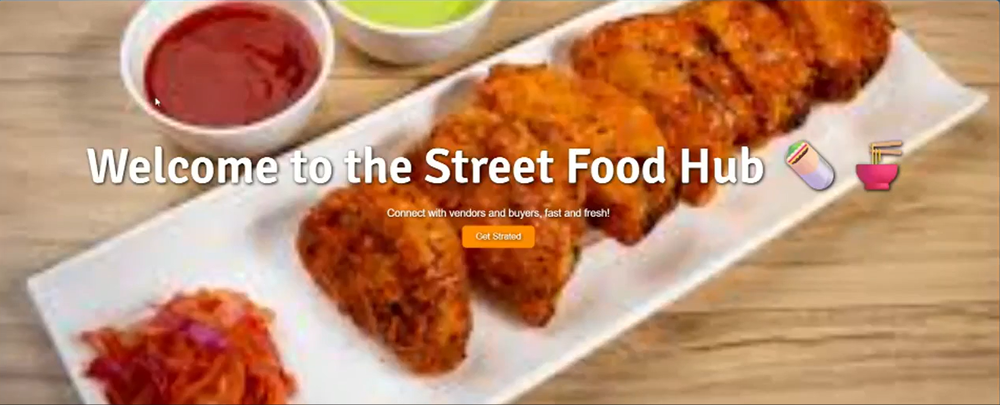
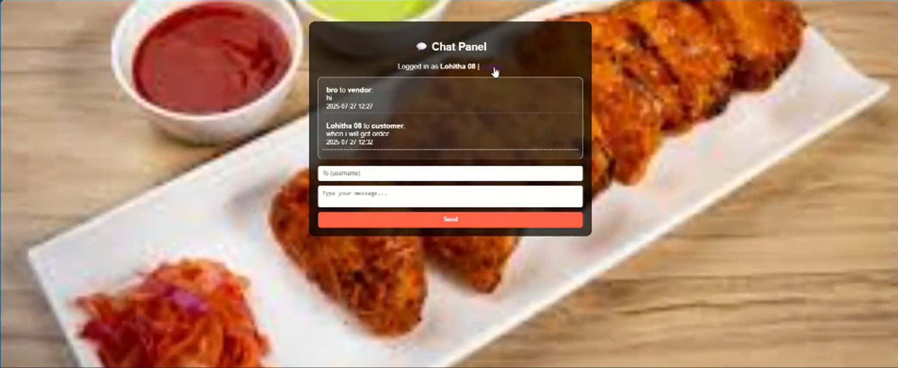
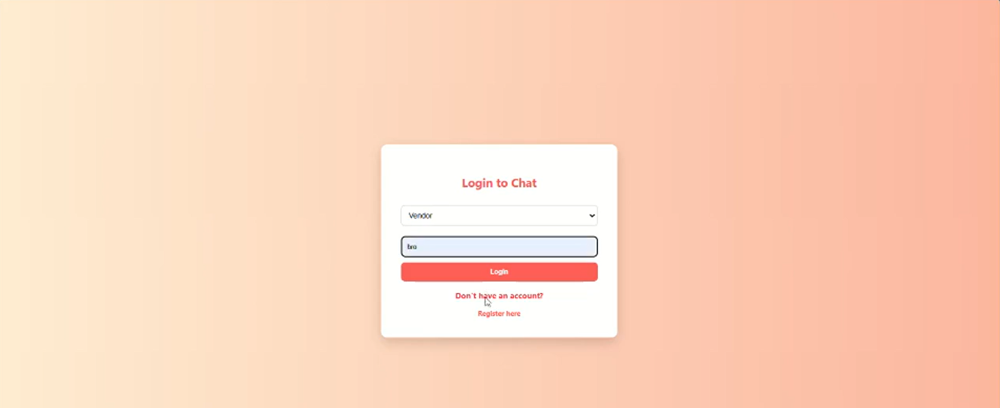
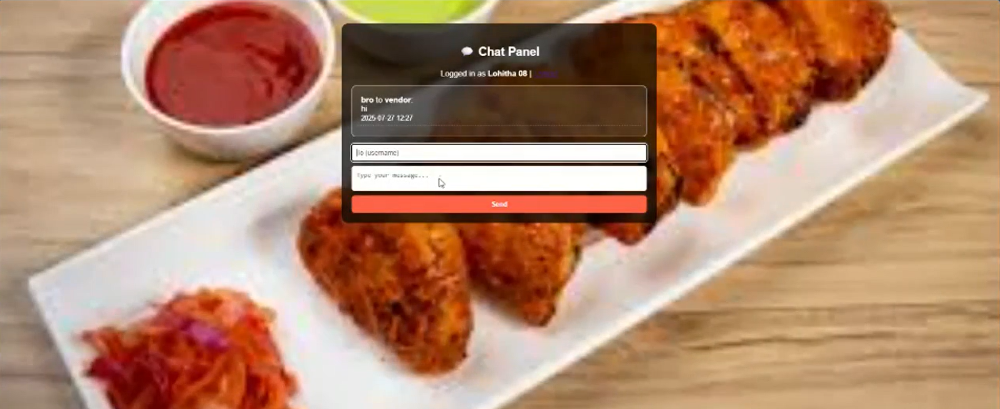

# Street-Food---Hub-
# 🥗 Zero Hunger: Food Redistribution Web Platform

A social impact web application built to **minimize food wastage** and support **hunger alleviation** by digitally connecting **food donors (restaurants, event organizers)** with **NGOs and volunteers** for real-time food collection and distribution.

> 💡 *“Saving food, serving humanity.”*  
> This platform supports
> 1.**Sustainable Development Goal**
>  2: **Zero Hunger** by transforming surplus food into a lifeline for the needy.

## 🚀 Overview

This platform offers:

- 🔐 **Role-Based Login**: Separate access for Admin and Donor users
- 📝 **Food Donation Submission**: Seamless food availability form for restaurants or individuals
- 📦 **Donation Records Management**: Real-time tracking and monitoring by Admins
- 🤝 **Volunteer & NGO Coordination**: Efficient collection and redistribution
- 📊 **Dashboard View**: Overview of donation history, status, and activity logs

---

## 🧑‍💻 Tech Stack

| Category    | Technologies Used            |
|-------------|-------------------------------|
| Frontend    | HTML, CSS, JavaScript, Bootstrap |
| Backend     | Python (Flask)               |
| Database    | MongoDB (NoSQL)              |
| Tools       | Git, GitHub, VS Code         |

---

## 🎬 Demo Preview

> 📹 **Project Demo Video**  
> Watch the live working of the platform in this demo:  
> [🔗 Click to view demo](https://drive.google.com/file/d/1_sntdeD37VIYmFqMiyf85B88rEZa0fkd/view?usp=drive_link)

| Home Page | Login Page | Admin Panel | Donation Form |
|-----------|------------|--------------|----------------|
| | Home Page                      | Login Page                      | Admin Panel                     | Donation Form                   |
|     |      |      |       |

---

👩‍💼 My Role & Contributions
🎨 Designed a responsive and intuitive frontend interface

🔗 Developed backend logic using Flask for user login, data submission, and admin control

🗃️ Integrated MongoDB for storing and managing donation and user data

🧪 Tested all modules and recorded a full working demo

🎯 Focused on building a practical solution for real-world food redistribution

---
🌍 Why This Matters
Food insecurity and waste are global challenges. This platform is a small but powerful step towards:

✅ Reducing food waste in urban settings

✅ Empowering NGOs and volunteers with real-time tools

✅ Bridging the gap between surplus and scarcity

✅ Promoting sustainable, tech-driven change

---
👩‍💻 Author ✨ Neelam Likhitha 🎓 Generative AI Intern @ NextHub Technologies Pvt. Ltd. 🌐 LinkedIn https://www.linkedin.com/in/neelam-likhitha-2a74a3296 📧 Mail: likitha0612@gmail.com 💻 Passionate about AI | ML | Deep Learning | Innovation
